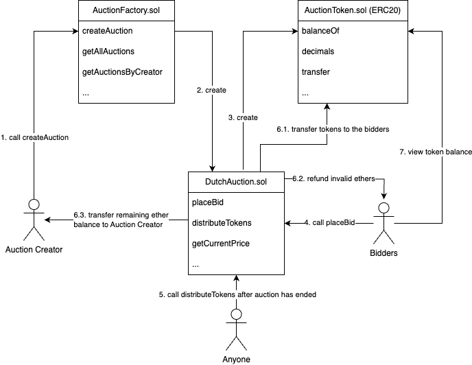

# BlockDutch

## 1. Introduction

This is a Dev Project submission for NTU CX4153 Blockchain Technology course

### Team Members

- Chantharojwong Kasidis (U2020731L)
- Chen Yi (U2121925C)
- Kunthamas Donchada (U2123242J)

## 2. Project Structure

### 2.1. Folder structure

- `apps` directory
  - `apps/hardhat` = Hardhat project for developing and deploying smart contracts
    - `apps/hardhat/contracts` = Smart contracts written in Solidity
    - `apps/hardhat/test` = Tests written with ethers and chai
  - `apps/web` = Next.js frontend for interacting with smart contracts

### 2.2. Smart Contracts Architecture



## 3. How to interact with our deployed frontend (Auction Factory is deployed in Sepolia testnet)

1. visit https://blockdutch.ckasidis.com to view the deployed frontend.
2. connect to your wallet with metamask, coinbase wallet, or injected connector.
3. switch your network to Sepolia testnet

## 4. How to start project locally

### 4.1. Install node dependencies

run the following command in the root of this project:

```sh
npm install
```

### 4.2. Compile smart contracts

run the following command in the root of this project:

```sh
npm run compile
```

### 4.3. Deploy Auction Factory contract

1.  start local hardhat network by running the following command in the root directory of this project:
    ```sh
    npm run node
    ```
2.  In a new terminal session, deploy the Auction Factory contract to local hardhat network by running the following command in the root directory of this project:
    ```
    npm run deploy:local
    ```

### 4.4. Interact with Frontend

1. in the `.env` file in the root directory of this project, set `NEXT_PUBLIC_AUCTION_FACTORY_ADDRESS` environment variable to the auction factory address printed from the previous step. For example:

   ```
   NEXT_PUBLIC_AUCTION_FACTORY_ADDRESS=0x5FbDB2315678afecb367f032d93F642f64180aa3
   ```

2. start frontend dev server by running the following command in the root directory of this project:
   ```
   npm run dev
   ```
3. visit http://localhost:3000/auctions to view the frontend.
4. connect to your wallet with metamask, coinbase wallet, or injected connector.
5. switch your network to localhost (local hardhat network)

## 5. How to deploy this project to Sepolia testnet by yourself

### 5.1. Install node dependencies

run the following command in the root of this project:

```sh
npm install
```

### 5.2. Compile smart contracts

run the following command in the root of this project:

```sh
npm run compile
```

### 5.3. Deploy Auction Factory contract

1. in the `.env` file in the root directory of this project, set `SEPOLIA_GATEWAY_URL` and `SEPOLIA_PRIVATE_KEY` environment variables. For example:
   ```
   SEPOLIA_GATEWAY_URL=<YOUR SEPOLIA GATEWAY URL>
   SEPOLIA_PRIVATE_KEY=<YOUR SEPOLIA PRIVATE KEY>
   ```
2. deploy the Auction Factory contract to Sepolia testnet by running the following command in the root directory of this project:
   ```
   npm run deploy:sepolia
   ```

### 5.4. Deploy the Frontend

Deploy the frontend Next.js app with `NEXT_PUBLIC_AUCTION_FACTORY_ADDRESS` and `NEXT_PUBLIC_ALCHEMY_API_KEY` environment variables.

### 5.5. Interacting with the frontend

1. visit your deployed frontend.
2. connect to your wallet with metamask, coinbase wallet, or injected connector.
3. switch your network to Sepolia testnet

### 6. Important available commands in root directory

```sh
# Hardhat

# compile smart contracts developed with Hardhat (apps/hardhat/contracts)
npm run compile
# deploy Auction Factory contract to local hardhat network
npm run deploy:local
# deploy Auction Factory contract to Sepolia testnet
npm run deploy:sepolia
# start local hardhat network
npm run node
# test smart contracts
npm run test
# test smart contracts with gas report
npm run test:report-gas


# Frontend

# build frontend
npm run build
# start frontend dev server
npm run dev
# run linter
npm run lint
# run linter fix
npm run lint:fix


# Other commands

# run git commit
npm run commit
# run prettier check
npm run format:check
# run prettier fix
npm run format:fix
```
